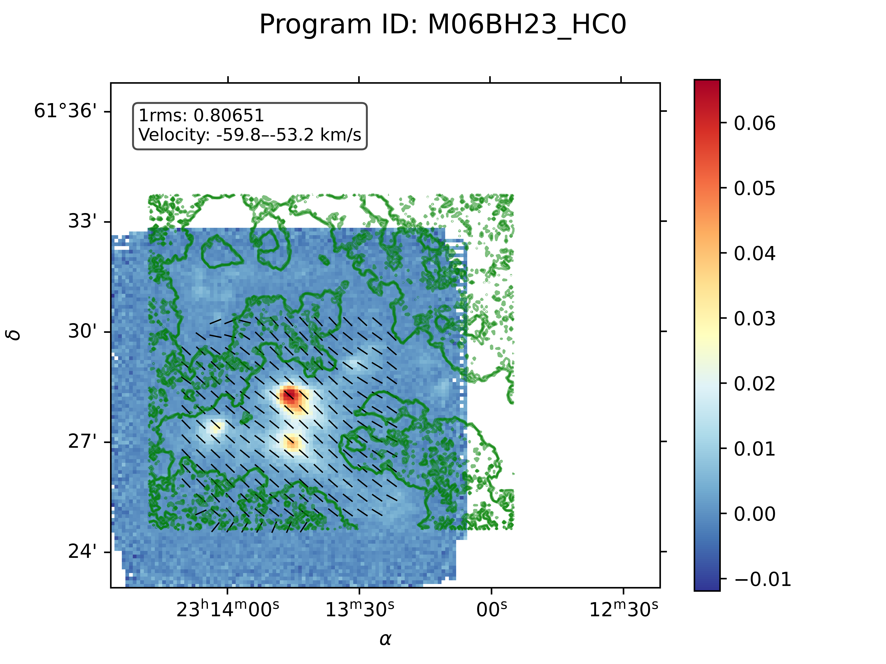
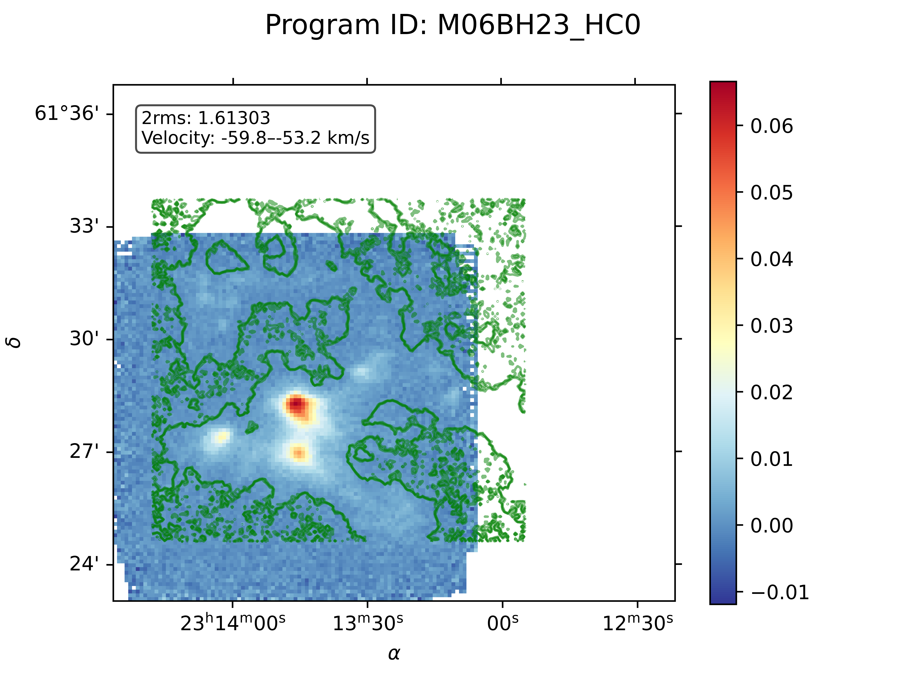

## NGC 7538 Data Processing Pipeline

Clean, reproducible pipeline to process JCMT/heterodyne spectral cubes for NGC 7538-like programs. It orchestrates:

- Julia notebook execution for PSI/VGT computation
- STARLINK/KAPPA moment-0 integration and WCS velocity handling
- Python notebook for visualization and QA plots

Outputs (per dataset) are written to the corresponding folder under `data/`.


### Features
- Orchestrated, end‑to‑end processing via a single entrypoint
- Configuration‑driven (JSON per dataset)
- Notebook execution in headless mode (Julia and Python)
- STARLINK integration for velocity WCS and moment maps
- Noise statistics extraction and archival as JSON


### Repository Structure
```
ngc7538/
  configs/                 # JSON configs for datasets
  data/                    # Input FITS and generated outputs per programID
  LMC_range1_psi.ipynb     # Julia notebook (PSI/VGT computation)
  LMC_VGT_visual.ipynb     # Python notebook (visualization)
  pipeline_base.py         # Abstract pipeline contract
  pipeline.py              # Concrete pipeline: STARLINK + notebooks
  run_pipeline.py          # CLI entrypoint
  vgt/                     # Julia modules used by the notebook
```


### Requirements
- macOS or Linux shell environment
- Python 3.10+ (virtualenv recommended)
- Julia 1.11 kernel available to Jupyter (kernel name `julia-1.11`)
- STARLINK installed and initialized (`$STARLINK_DIR` must be set)

Python packages (install via pip):

```bash
pip install nbclient nbformat
```

If you do not already have a Julia Jupyter kernel, in Julia run:

```julia
using Pkg
Pkg.add(["IJulia"])  # ensures the Julia kernel is registered
```

STARLINK must be sourced in non-interactive shells. The pipeline takes care of this by running:

```bash
source "$STARLINK_DIR/etc/profile" && convert && kappa
```


### Quickstart
1) Create and activate a virtual environment (optional, recommended):

```bash
python3 -m venv env
source env/bin/activate
pip install nbclient nbformat
```

2) Verify STARLINK is installed and `$STARLINK_DIR` is exported in your shell profile.

3) Place input FITS cubes inside `data/<programID>/` (see Configuration below).

4) Run the pipeline for one config (default example):

```bash
python run_pipeline.py
```

5) Or run for a different set of configs using a glob pattern:

```bash
python -c 'from pipeline import Pipeline; Pipeline().run("M09BH09C_CO*.json")'
```


### Configuration
Each dataset is defined by a JSON file in `configs/`. Example (truncated from `M06BH23_HC0.json`):

```json
{
  "programID": "M06BH23_HC0",
  "fits_file": "*reduced*.fits",   
  "subblock_size": 10,
  "noise_multiplier": 1,
  "frequency_range": [356.818, 356.81],
  "velocity_range": [-59.7573, -53.1919],
  "noise_range": [-322.783, -81.9155]
}
```

- programID: Folder name under `data/` where inputs and outputs live
- fits_file: Glob pattern to match the spectral cube inside `data/<programID>/`
- frequency_range: Integration range (if used by notebooks; STARLINK collapse uses velocity_range)
- velocity_range: Moment‑0 integration limits for STARLINK `collapse`
- noise_range: Velocity window for noise statistics
- subblock_size, noise_multiplier: Passed into notebooks as needed


### Data Layout
Place input files as follows:

```
data/
  <programID>/
    <your spectral cube>.fits     # should match the config's fits_file pattern
    # pipeline will create outputs here
```


### What the Pipeline Produces
For each config, under `data/<programID>/` the pipeline may generate:
- `psi.fits` (or notebook-defined PSI/VGT products)
- `mom0.fits` (moment‑0 map via STARLINK `collapse`)
- `noisemap.sdf`, `1kms.sdf`, `1kms_noisemap.sdf` (intermediates)
- `noisemap_stats.json`, `1kms_error_stats.json`, `1kms_noisemap_stats.json`
- Visualization PNGs produced by `LMC_VGT_visual.ipynb`


### Sample Outputs
Below are sample visualizations from the repository (rendered directly from committed PNGs):

#### M06BH23_HC0
Moment integration ranges overlayed on diagnostics from the Python notebook.



Noise-multiplier comparisons (1×, 2×, 3×):





You can regenerate these by running the pipeline for `M06BH23_HC0` (ensure matching inputs under `data/M06BH23_HC0/`).


### Programmatic Use
```python
from pipeline import Pipeline

pipeline = Pipeline(
    julia_notebook="LMC_range1_psi.ipynb",
    python_notebook="LMC_VGT_visual.ipynb",
)
pipeline.run("M09BC12_CO.json")  # or any glob, e.g., "M09*CO*.json"
```


### Notebooks
- `LMC_range1_psi.ipynb` (Julia): The pipeline injects variables `config_path` and `noise_path` into cell 1, then executes with kernel `julia-1.11`.
- `LMC_VGT_visual.ipynb` (Python): The pipeline injects `config_path` into cell 1, then executes with kernel `python3`.

Ensure that any Julia dependencies (e.g., modules in `vgt/`) are resolvable by the notebook (e.g., add to LOAD_PATH within the notebook or use a Julia project environment).


### STARLINK Notes
The pipeline invokes STARLINK KAPPA utilities non‑interactively:
- `wcsattrib` to set WCS to velocity: `vrad` in frame `LSRK`
- `collapse` with `estimator=Integ` for moment‑0 and `estimator=sigma` for RMS
- `stats` to extract noise metrics (parsed into JSON)

If STARLINK is not initialized, export `STARLINK_DIR` in your shell and verify:

```bash
source "$STARLINK_DIR/etc/profile" && which collapse && which wcsattrib
```


### Troubleshooting
- Kernel not found: Ensure the Julia kernel name is `julia-1.11` (see `pipeline.py`). Register via IJulia if needed.
- No FITS matched: Confirm `fits_file` glob matches a file in `data/<programID>/`.
- STARLINK command not found: Validate `$STARLINK_DIR` and that `convert`/`kappa` are available after sourcing.
- Stats parsing error: The parser expects STARLINK `stats` output blocks; upgrade STARLINK or share the `stats` text for adjustments.


### Development
- Core contract in `pipeline_base.py`
- Concrete implementation in `pipeline.py`
- CLI entrypoint in `run_pipeline.py`

Run a subset of configs while developing, e.g.:

```bash
python -c 'from pipeline import Pipeline; Pipeline().run("M06BH23*.json")'
```


